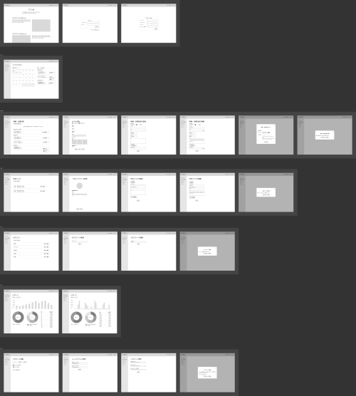
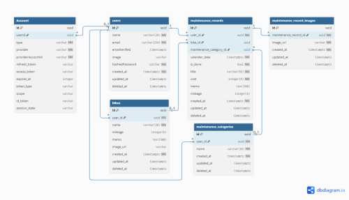

# バイクの整備記録・出費管理アプリ

## デモURL

[https://moto-maintrecord.vercel.app/](https://moto-maintrecord.vercel.app/)

<br>**デモアカウント**

```
demo01@example.com
demo0101
```

## 概要

バイクの整備と出費を記録・管理することができるWebアプリです。

バイクに乗っている方で、以下のような悩みを解決することを目指しました。

- バイクの整備日誌と費用をまとめて管理したい。
- バイクの維持費に毎月どれだけかかってるのか把握したい。

<br>

このアプリを作ろうと思ったきっかけは、私自身が普段バイクに乗っていて、整備記録と出費をまとめて管理できるものがあったらいいなと思ったからです。

既存のアプリで似たようなものが無いか探してみたところ、イメージに近いものが無かったため、それなら自分が作ってみようと思い、開発を始めました。

## 主な機能

| 機能                                          | 説明                                                                                                                                                       |
| --------------------------------------------- | ---------------------------------------------------------------------------------------------------------------------------------------------------------- |
| 整備・出費記録<br>（一覧表示/登録/編集/削除） | バイクを整備したりツーリング等で出費が発生したときに、日付や費用などを記録する。<br>例）バイクを整備したとき。ツーリングしたとき。バイク用品を買ったとき。 |
| 所有バイク<br>（一覧表示/登録/編集/削除）     | 現在乗っているバイクを登録する。複数登録可。                                                                                                               |
| カテゴリー<br>（一覧表示/登録/編集/削除）     | 整備・出費記録用のカテゴリー。<br>例）整備代、ガソリン代、高速料金、任意保険料、自賠責、駐車代                                                             |
| カレンダー                                    | 月間カレンダーで日毎に出費金額を表示。                                                                                                                     |
| レポート                                      | 出費金額をグラフ化。年間や月間の合計金額や、合計金額の内訳（カテゴリーや所有バイクの割合、月別、日別）が把握できる。                                       |
| アカウント管理                                | メールアドレスやパスワードの変更。アカウントの削除。                                                                                                       |

## 使用技術

| カテゴリー              | 技術                                                                        |
| ----------------------- | --------------------------------------------------------------------------- |
| 基本構成                | Next.js (App Router, Route Handlers)<br>React<br>TypeScript<br>Tailwind CSS |
| UIライブラリ            | Material UI (MUI), FullCalendar                                             |
| データベース/ストレージ | Supabase                                                                    |
| ORM                     | Prisma                                                                      |
| 認証機能                | Auth.js (NextAuth.js v5)                                                    |
| 状態管理                | zustand                                                                     |
| リンター/フォーマッター | ESLint, Prettier                                                            |
| バリデーション          | Zod, React Hook Form                                                        |

## ワイヤーフレーム

- [バイクの整備記録・出費管理アプリ - Figma](https://www.figma.com/design/mFIMlpzKW4Peb8j68G4AQI/%E3%83%90%E3%82%A4%E3%82%AF%E3%81%AE%E6%95%B4%E5%82%99%E8%A8%98%E9%8C%B2%E3%83%BB%E5%87%BA%E8%B2%BB%E7%AE%A1%E7%90%86%E3%82%A2%E3%83%97%E3%83%AA?node-id=48-2&t=eDyhWJleoldsiz5k-1)
- [PDF](docs/wireframe_20251107.pdf)



## ER図

- [バイクの整備記録・出費管理アプリ \- dbdiagram\.io](https://dbdiagram.io/d/%E3%83%90%E3%82%A4%E3%82%AF%E3%81%AE%E6%95%B4%E5%82%99%E8%A8%98%E9%8C%B2%E3%83%BB%E5%87%BA%E8%B2%BB%E7%AE%A1%E7%90%86%E3%82%A2%E3%83%97%E3%83%AA-68c66aa9841b2935a67527f7)
- [PDF](docs/er-diagram_20251107.pdf)



## 今後予定している機能

- 整備・出費記録のコピー機能
- レポートの絞り込み機能: 所有バイク別、カテゴリー別
- 整備・出費記録の一括編集・削除機能
- Googleカレンダーと連携: 次回の〇〇交換時期や保険更新時期をGoogleカレンダー経由で通知を受け取れるようにする
