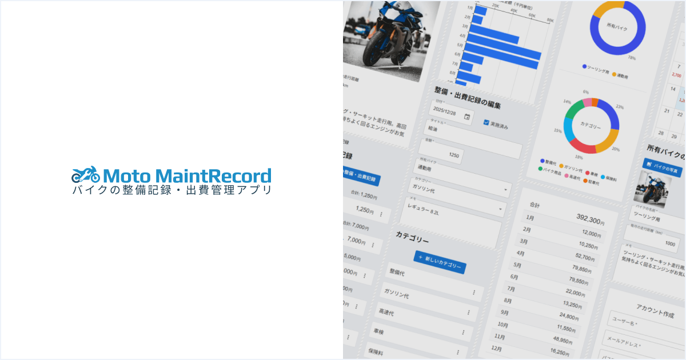
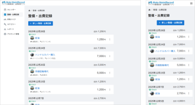
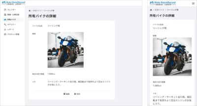
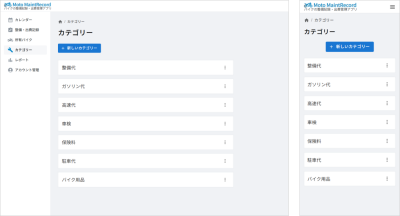
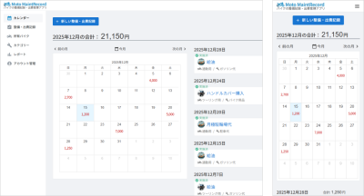
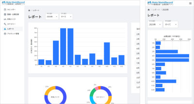
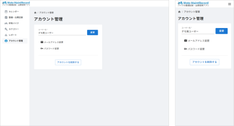

# 「Moto MaintRecord (モト・メンテレコード)」<br>バイクの整備記録・出費管理アプリ



## デモURL

[https://moto-maintrecord.vercel.app/](https://moto-maintrecord.vercel.app/)

<br>**デモアカウント**

```
demo01@example.com
demo01@@@@@@
```

## 概要

「Moto MaintRecord」は、バイクの整備や出費の内容を記録し、管理することができるWebアプリです。

バイクに乗っている方で、以下のような悩みを解決することを目指しました。

- バイクの整備記録と出費記録をまとめて管理したい。
- バイクの維持費が毎月どれだけかかってるのか把握したい。

<br>

このアプリを作ろうと思ったきっかけは、私自身が普段バイクに乗っていて、整備記録と出費をまとめて管理できるものがあったらいいなと思ったからです。

既存のアプリで似たようなものが無いか探してみたところ、イメージに近いものが無かったため、それなら自分が作ってみようと思い、開発を始めました。

## 主な機能

- 整備・出費記録
- 所有バイク
- カテゴリー
- カレンダー
- レポート
- アカウント管理

| 機能                                                                                                                           | 説明                                                                                                                                                                                                                                                                                               |
| ------------------------------------------------------------------------------------------------------------------------------ | -------------------------------------------------------------------------------------------------------------------------------------------------------------------------------------------------------------------------------------------------------------------------------------------------- |
| <center>整備・出費記録</center>  | バイクに関係する出費が発生したとき、その内容を記録する。<br /><br />例）ガソリンスタンドで給油したとき。バイクショップでタイヤ交換したとき。通販でバイクジャケットやグローブを買ったとき。                                                                                                         |
| <center>所有バイク</center>        | 現在乗っているバイクを登録する。<br /><br />新しい「整備・出費記録」を登録するときに所有バイクを選択することで、「レポート」で所有バイクごとの出費金額の割合が把握できるようになる。                                                                                                               |
| <center>カテゴリー</center>    | 「整備・出費記録」を内容ごとに分類できる。<br /><br />例）整備代、ガソリン代、高速料金、保険料（任意保険・自賠責）、駐車料金、バイク用品など。<br /><br />新しい「整備・出費記録」を登録するときにカテゴリーを選択することで、「レポート」でカテゴリーごとの出費金額の割合が把握できるようになる。 |
| <center>カレンダー</center>    | 月の合計金額や、その日いくら出費したのかをカレンダーで把握できる。<br /><br />スケジュールとして使うことも可能。「整備・出費記録」で来月の整備などの予定を登録し、来月は整備などの支払いで合計いくら必要、といったことが把握できる。                                                               |
| <center>レポート</center>        | バイクの出費金額をグラフ化。<br /><br />年間や月間の合計金額や、合計金額の内訳（月別、日別、カテゴリー別、所有バイク別）が把握できる。                                                                                                                                                             |
| <center>アカウント管理</center> | ユーザー名、メールアドレス、パスワードの変更ができる。                                                                                                                                                                                                                                             |

## 使用技術

| カテゴリー              | 技術                                                                                          |
| ----------------------- | --------------------------------------------------------------------------------------------- |
| 基本構成                | Next.js (App Router, Route Handlers)<br>React<br>TypeScript<br>Tailwind CSS                   |
| UIライブラリ            | Material UI (MUI), FullCalendar                                                               |
| データベース/ストレージ | Supabase                                                                                      |
| ORM                     | Prisma                                                                                        |
| 認証機能                | Auth.js (NextAuth.js v5)                                                                      |
| 状態管理                | zustand                                                                                       |
| リンター/フォーマッター | ESLint, Prettier                                                                              |
| バリデーション          | Zod, React Hook Form                                                                          |
| その他                  | アプリのロゴ、アイコン: ChatGPTで作成<br />デモ用データ: Geminiで作成。画像はUnsplashからDL。 |

## ワイヤーフレーム

- [バイクの整備記録・出費管理アプリ - Figma](https://www.figma.com/design/mFIMlpzKW4Peb8j68G4AQI/%E3%83%90%E3%82%A4%E3%82%AF%E3%81%AE%E6%95%B4%E5%82%99%E8%A8%98%E9%8C%B2%E3%83%BB%E5%87%BA%E8%B2%BB%E7%AE%A1%E7%90%86%E3%82%A2%E3%83%97%E3%83%AA?node-id=48-2&t=eDyhWJleoldsiz5k-1)
- [PDF](docs/wireframe_20251107.pdf)


## ER図

- [バイクの整備記録・出費管理アプリ \- dbdiagram\.io](https://dbdiagram.io/d/%E3%83%90%E3%82%A4%E3%82%AF%E3%81%AE%E6%95%B4%E5%82%99%E8%A8%98%E9%8C%B2%E3%83%BB%E5%87%BA%E8%B2%BB%E7%AE%A1%E7%90%86%E3%82%A2%E3%83%97%E3%83%AA-68c66aa9841b2935a67527f7)
- [PDF](docs/er-diagram_20251107.pdf)


## 今後予定している機能

- 整備・出費記録:
  - 絞り込み機能（所有バイク、カテゴリー）
  - ソート機能（日付、金額）
  - 一括編集機能（所有バイク、カテゴリー、実施済）
  - 一括削除機能
  - コピー（複製）機能
- レポート:
  - 絞り込み機能（所有バイク、カテゴリー）
  - 集計テーブル（所有バイク、カテゴリー）
- Googleカレンダーと連携: 次回の〇〇交換時期や保険更新時期をGoogleカレンダー経由で通知を受け取れるようにする
